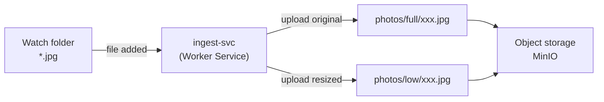

# ingest-svc

Cross-platform service that watches a folder for new `.jpg` files, generates a low-resolution copy, and uploads both versions to object storage (MinIO).

## Role in the architecture



## Requirements

- .NET 8 SDK
- MinIO accessible on `localhost:9000` (via Docker)

> MinIO is managed by [stand-infra](https://github.com/Association-Ephemere/stand-infra). Run docker compose up there first.

## Configuration

Create an `appsettings.local.json` file at the root (not committed):

```json
{
  "Watcher": {
    "Path": "C:\\path\\to\\watch"
  },
  "Storage": {
    "Endpoint": "localhost:9000",
    "AccessKey": "minioadmin",
    "SecretKey": "minioadmin",
    "Bucket": "photos",
    "FullPrefix": "full",
    "LowPrefix": "low"
  },
  "Resize": {
    "MaxWidth": 800,
    "MaxHeight": 800
  }
}
```

## Run in development

```bash
dotnet run --project src/IngestSvc
```

## Run tests

```bash
dotnet test
```

## Contributing

See [CONTRIBUTING.md](CONTRIBUTING.md)
